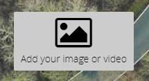
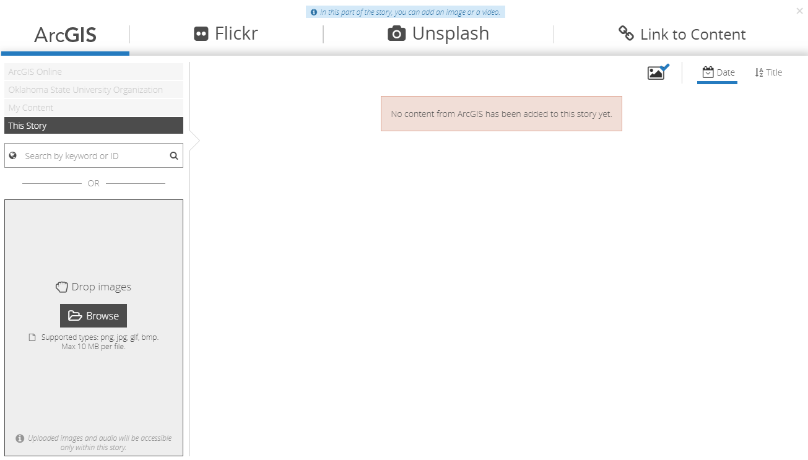
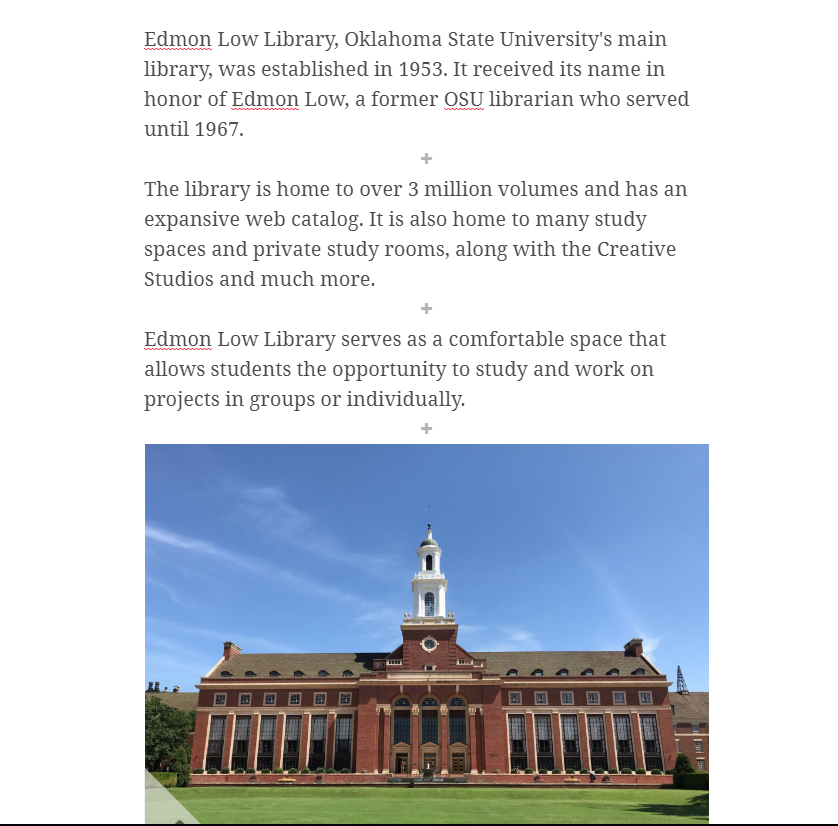
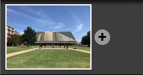
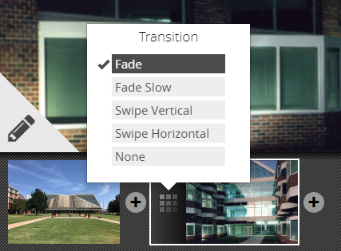

## About
Last Updated *[7/12/2019]*   
Created by [OSU Maps and Spatial Data](https://info.library.okstate.edu/map-room)

## Table of Contents
- Introduction 
- *[Story Map Cascade]*
- - Making a Story Map Cascade
- - - Getting Started
- - - Title Page
- - - Adding Text
- - - Adding Media
- - - Adding a Title Section
- - - Adding Narrative
- - - Adding an Immersive Section
- - - Finishing Up
- Conclusion
- Further Reading/Resources

## Introduction
Story Maps are a relatively new and unique way of telling stories by using maps, images and videos. Esri offers many different Story Map templates that can be utilized for a multitude of projects and purposes.

## *[Story Map Cascade]*
The Story Map Cascade allows you to create an engaging scrolling experience that is full screen. Using this option allows you to add narrative, images, videos and much more. Sections can be separated by immersive sections with animations and transitions.

#### Making a Story Map Cascade

##### Getting Started
1. In order to locate the older story map templates, visit this [website](https://storymaps-classic.arcgis.com/en/app-list/?buildApp=true).
2. Locate the Story Map Cascade and select **Build**.

3. Login to your esri account and continue to Cascade Builder. 

##### Title Page
1. The first thing you should do here is add a title. Simply enter the text into the box.

2. To change the image, you must first save your project.

3. Select **Add your image or video**.

4. You can use different ways to access your images, such as Flickr, but for this tutorial we will upload images to ArcGIS from our computer. Browse for, or drag and drop, the image you wish to use.

5. To change the image, select the *Pencil* icon in the lower lefthand corner, click **Manage** and **Change Media**. When you are satisfied, click the checkmark in the lower left corner.

6. You can change the appearance of the title by clicking the *Pencil* icon, clicking **Appearance** and selecting the desired **Theme**. Click the white checkmark when finished.

7. You can adjust the background placement by clicking the same *Pencil* icon, navigating to **Background** and moving the blue circle as desired. The *Previews* to the right wil show you how the photo will look at different orientations of a screen. When satisfied, click the white checkmark. 

##### Adding Text
1. To add to your story, click the white arrow at the bottom of the page.

2. Then click **+**.

3. We will start by adding text. Click **Text**.

4. In the blank space, type the desired text.

5. To change the style or orientation of the text click the icon beside it.

6. Change the text as desired.

7. You can also change the color, bolden or italicize the text by selecting it and using one of the tools that appears.

##### Adding Media
1. Next we will add media. Click **+** and **Media**

2. Add the desired image.
3. To add multiple images, repeat steps 18 and 19.
4. You can add captions to the images by clicking **Your caption here...** and typing the desired caption.

#### Adding a Title Section
1. Now we will add a title section. Click **+** and **Title**.

2. Type the title into the alloted area.

3. You can leave the generic background media or add your own by choosing **Add media** and adding the desired photo.

##### Adding Narrative
1. Click the circle under the title.

2. Click **Narrative**.

3. Type any information you wish to include in the area designated by **Continue your story here...**.

4. If you wish to add more text or media, click **+** and add what you desire.

##### Adding an Immersive Section
1. After clicking the circle, select **Immersive**.

2. Add a title and edit the theme as desired with the *Pencil* icon.

3. **Add media** as desired. 
4. Scroll down until a box with **Continue your story here...** appears. Type text into this box. More text sections and media can also be added here and the appearance can be adjusted.

5. To add another slide to this immersive section, click the circle with a + at the bottom of the screen.

6. To use a transition, click on the square of boxes in between two slides.

7. Choose a transition you like and use it.

8. You can change the order of the slides in an immersive section by clicking the two arrows and dragging and dropping the slides where you would like them.

9. You can do the same thing with sections of the Story Map Cascade as a whole. Just click **Organize** and position sections where you would like them. Click **Done** when you are finished.

##### Finishing Up

1. To change the logo, add bookmarks or change appearance of headings and text as a whole, click the **Tool** icon.

2. To check for any detected issues, take a glance at the **Heart**. If there is a *green checkmark* there are no major errors.

3. To share the project, click one of these three options: **Private, Organization** or **Public**.

4. To preview the story, click on the **Eye**. This opens a new tab where you can explore your story as a reader.

5. Before we close the project, it is important we give credit to those who provided the information and media we used. At the very bottom of the project, click **Add a credits section**. Type in all necessary information.

6. Be sure to save before you leave the project!

## Conclusion
Story Map Cascade is a great resource for guiding people through an immersive, interactive experience.

## Further Reading/Resources

[Return to Top](#about)
